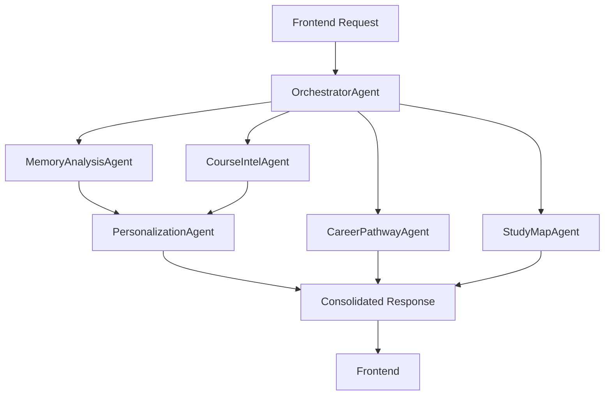

# Sensa AI Multi-Agent System (ADK)

A sophisticated multi-agent system built with the Agent Development Kit (ADK) that powers personalized, memory-driven learning experiences for Sensa AI.

## Architecture

The system consists of 6 specialized agents orchestrated by a central coordinator:

### 🎭 OrchestratorAgent (The Conductor)
- **Role**: Central hub and task coordinator
- **Responsibilities**: Receives requests, delegates tasks, consolidates results
- **Tools**: Task delegation, data retrieval, result consolidation

### 🧠 MemoryAnalysisAgent (The Empath)
- **Role**: Memory analysis and learning profile synthesis
- **Responsibilities**: Analyzes user memories for themes, emotional patterns, and learning indicators
- **Tools**: Memory analysis, learning profile generation

### 📚 CourseIntelAgent (The Academic)
- **Role**: Educational content analysis
- **Responsibilities**: Analyzes course syllabi, identifies learning objectives, extracts key concepts
- **Tools**: Course analysis, document analysis

### 🌟 PersonalizationAgent (The Bridge)
- **Role**: Creates personalized learning connections  
- **Responsibilities**: Generates analogies and study tips based on user memories
- **Tools**: Analogy creation, personalized study tip generation

### 🚀 CareerPathwayAgent (The Mentor)
- **Role**: Career guidance and pathway generation
- **Responsibilities**: Creates traditional and personalized career recommendations
- **Tools**: Career pathway generation, career fit analysis

### 🗺️ StudyMapAgent (The Cartographer)
- **Role**: Visual learning map creation
- **Responsibilities**: Generates Mermaid.js study maps and structured study guides
- **Tools**: Mermaid diagram generation, study guide creation

## Agent Workflow



## Setup

### Prerequisites
- Python 3.9+
- Google Cloud CLI
- Agent Development Kit (ADK)
- Google Cloud Project with Cloud Functions enabled

### Installation

1. **Clone and setup the project:**
```bash
cd adk-agents
pip install -r requirements.txt
```

2. **Configure environment variables:**
```bash
cp env.template .env
# Edit .env with your API keys:
# GOOGLE_AI_API_KEY=your_google_ai_api_key
# SUPABASE_URL=your_supabase_url  
# SUPABASE_ANON_KEY=your_supabase_anon_key
```

3. **Test locally:**
```bash
python -m src.main
```

### Deployment

Deploy to Google Cloud Functions:

```bash
python deploy.py
```

This will deploy two Cloud Functions:
- `sensa-agents`: Main agent orchestrator
- `sensa-agents-health`: Health check endpoint

## API Usage

### Analyze Course for User
```json
POST /sensa-agents
{
  "action": "analyze_course",
  "user_id": "user_123",
  "course_query": "Introduction to Machine Learning"
}
```

### Analyze Single Memory (Onboarding)
```json
POST /sensa-agents
{
  "action": "analyze_memory", 
  "memory_content": "I remember building a treehouse with my dad...",
  "category": "childhood"
}
```

### Generate Study Map
```json
POST /sensa-agents
{
  "action": "generate_study_map",
  "field_of_study": "Computer Science",
  "course_syllabus": ["Programming", "Data Structures", "Algorithms"],
  "user_id": "user_123"
}
```

## Response Format

All responses follow this structure:

```json
{
  "success": true,
  "course_analysis": {
    "course_name": "Introduction to Machine Learning",
    "key_topics": ["Supervised Learning", "Neural Networks"],
    // ... more course details
  },
  "learning_profile": {
    "dominant_learning_style": "Visual-Kinesthetic",
    "emotional_anchors": ["Achievement", "Curiosity"],
    // ... more profile details
  },
  "personalized_insights": {
    "memory_connections": [
      {
        "concept": "Neural Networks",
        "analogy": "Like the treehouse you built...",
        "study_tip": "Try building a simple neural network..."
      }
    ]
  },
  "career_pathways": {
    "pathways": [
      {
        "type": "The Prominent Path",
        "field_name": "Machine Learning Engineer",
        "description": "...",
        "memory_link": "..."
      }
    ]
  },
  "study_map": {
    "mermaid_code": "flowchart TD...",
    "node_data": {...},
    "legend_html": "..."
  },
  "timestamp": "2024-01-15T10:30:00Z"
}
```

## Error Handling

Errors are returned in this format:

```json
{
  "success": false,
  "error": "Description of the error",
  "timestamp": "2024-01-15T10:30:00Z"
}
```

## Development

### Project Structure
```
adk-agents/
├── src/
│   ├── agents/           # Individual agent implementations
│   ├── base_agent.py     # Base agent class
│   ├── config.py         # Configuration management
│   ├── types.py          # Type definitions
│   └── main.py           # Cloud Functions entry point
├── requirements.txt      # Python dependencies
├── deploy.py            # Deployment script
└── README.md           # This file
```

### Adding New Agents

1. Create a new agent class inheriting from `SensaBaseAgent`
2. Implement the required `process()` method
3. Add agent-specific tools and methods
4. Register the agent in `OrchestratorAgent`

### Testing

Run the test suite:
```bash
python -m pytest tests/
```

Test individual agents:
```bash
python -c "
import asyncio
from src.agents import MemoryAnalysisAgent

async def test():
    agent = MemoryAnalysisAgent()
    result = await agent.process({
        'action': 'analyze_single_memory',
        'memory_text': 'Test memory',
        'category': 'childhood'
    })
    print(result)

asyncio.run(test())
"
```

## Migration from Supabase Functions

This system replaces the individual Supabase Edge Functions:
- `memory-analysis` → `MemoryAnalysisAgent`
- `course-analysis` → `CourseIntelAgent` + `PersonalizationAgent`  
- `career-pathways` → `CareerPathwayAgent`
- `study-map-generator` → `StudyMapAgent`
- `mermaid-cartographer` → `StudyMapAgent`

The orchestrator coordinates these agents to provide a more cohesive and intelligent learning experience.

## Monitoring

- Health check endpoint: `/sensa-agents-health`
- Cloud Functions monitoring in Google Cloud Console
- Logs available in Cloud Logging

## Contributing

1. Follow the existing agent patterns
2. Maintain backward compatibility with the frontend API
3. Add comprehensive error handling and fallbacks
4. Update this README with any new features

---

Built with ❤️ for personalized learning experiences. 