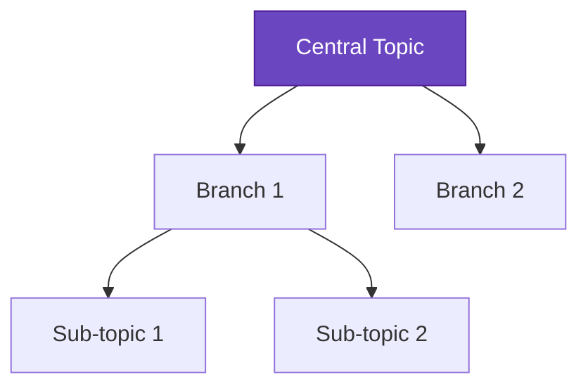

# Mind Map Editor Feature Guide

## Overview

The Mind Map Editor is a powerful new feature in the Sensa AI Integrated Learning Hub that allows users to create, edit, and customize interactive mind maps. This feature transforms static mind map visualizations into dynamic, editable canvases that users can personalize to match their learning style and preferences.

## Features

### 🎨 Interactive Editing
- **Add Nodes**: Click the "+" button to add new nodes to your mind map
- **Edit Text**: Double-click any node to edit its text content
- **Delete Nodes**: Select a node and click the trash icon to remove it
- **Connect Nodes**: Drag from one node to another to create connections
- **Move Nodes**: Drag nodes around the canvas to reorganize your mind map

### 🎯 Visual Customization
- **Shape Selection**: Choose from rectangle, circle, or diamond shapes
- **Color Palette**: 15 predefined colors for node backgrounds
- **Text Colors**: 4 text color options for optimal readability
- **Font Size**: Adjustable font size from 10px to 24px
- **Border Colors**: Automatic border color matching

### 🔗 Smart Connections
- **Curved Arrows**: Smooth, curved connections between nodes
- **Automatic Routing**: Smart edge routing to avoid overlaps
- **Directional Flow**: Clear visual hierarchy with arrow markers

### 📤 Export Options
- **Mermaid Syntax**: Export as `.mmd` file for use in markdown or documentation
- **SVG Format**: Scalable vector graphics for high-quality presentations
- **PNG Format**: Standard image format for sharing and embedding

## How to Use

### 1. Accessing the Editor
1. Navigate to the **Integrated Learning Hub**
2. Upload a document or select a course
3. Go to the **Visualize** tab
4. Click **Generate Mind Map** to create your initial mind map
5. Click **Edit Mode** to open the interactive editor

### 2. Basic Editing
- **Add Nodes**: Click the "+" button in the header toolbar
- **Edit Text**: Double-click any node and start typing
- **Move Nodes**: Click and drag nodes to reposition them
- **Connect Nodes**: Drag from the edge of one node to another
- **Delete Nodes**: Select a node and click the trash icon

### 3. Customization
1. **Select a Node**: Click on any node to select it
2. **Open Customization Panel**: Click the palette icon in the toolbar
3. **Choose Shape**: Select from rectangle, circle, or diamond
4. **Pick Colors**: Choose background and text colors
5. **Adjust Font Size**: Use the slider to change text size

### 4. Exporting Your Work
1. **Open Export Menu**: Click the download icon in the toolbar
2. **Choose Format**:
   - **Mermaid**: For technical documentation and version control
   - **SVG**: For scalable graphics and presentations
   - **PNG**: For sharing and embedding in documents

## Technical Implementation

### Architecture
```
src/components/MindMapEditor/
├── MindMapEditor.tsx      # Main editor component
├── index.ts              # Export declarations
└── styles/
    └── MindMapEditor.module.css  # Component styles
```

### Key Technologies
- **React Flow**: Node-based editor foundation
- **Framer Motion**: Smooth animations and transitions
- **HTML-to-Image**: Export functionality
- **D3.js**: SVG manipulation and advanced graphics
- **Mermaid**: Syntax compatibility

### Integration Points
- **EnhancedStudyMap.tsx**: Main integration point
- **Zustand Stores**: State management for persistence
- **Supabase Edge Functions**: Initial mind map generation
- **Memory System**: Personalized node suggestions

## Keyboard Shortcuts

| Action | Shortcut |
|--------|----------|
| Edit Node Text | Double-click node |
| Save Text | Enter |
| Cancel Edit | Escape |
| Delete Selected | Delete key |
| Pan Canvas | Mouse drag |
| Zoom | Mouse wheel |

## Customization Options

### Node Shapes
- **Rectangle**: Standard nodes for topics and concepts
- **Circle**: Central topics and key themes
- **Diamond**: Decision points and critical concepts

### Color Palette
- **Purple (#6B46C1)**: Primary topics
- **Orange (#F97316)**: Action items
- **Yellow (#F59E0B)**: Important notes
- **Green (#10B981)**: Completed items
- **Blue (#3B82F6)**: Information nodes
- **Red (#EF4444)**: Warnings or critical points

### Text Colors
- **White (#FFFFFF)**: For dark backgrounds
- **Black (#000000)**: For light backgrounds
- **Dark Gray (#374151)**: For subtle contrast
- **Medium Gray (#6B7280)**: For secondary text

## Export Formats

### Mermaid Syntax


### SVG Benefits
- Infinite scalability without quality loss
- Small file sizes for simple diagrams
- Web-compatible and printable
- Editable in vector graphics software

### PNG Advantages
- Universal compatibility
- High-resolution output (2x pixel ratio)
- Perfect for presentations and documents
- Easy sharing and embedding

## Best Practices

### 1. Mind Map Structure
- **Start with a central topic** in the middle
- **Use hierarchical organization** with main branches
- **Keep node text concise** (3-5 words maximum)
- **Use consistent colors** for similar concepts

### 2. Visual Design
- **Choose contrasting colors** for text and background
- **Use shapes meaningfully** (circles for main topics, rectangles for details)
- **Maintain consistent spacing** between nodes
- **Avoid crossing connections** when possible

### 3. Export Strategy
- **Use Mermaid** for version control and collaboration
- **Use SVG** for presentations and scalable graphics
- **Use PNG** for quick sharing and embedding

## Troubleshooting

### Common Issues
1. **Nodes not connecting**: Make sure to drag from the edge of a node
2. **Text not saving**: Press Enter after editing to confirm changes
3. **Export not working**: Check browser permissions for downloads
4. **Performance issues**: Limit mind maps to 50-100 nodes for optimal performance

### Browser Compatibility
- **Chrome**: Full support (recommended)
- **Firefox**: Full support
- **Safari**: Full support
- **Edge**: Full support
- **Mobile browsers**: Limited support (view-only recommended)

## Future Enhancements

### Planned Features
- **Collaborative editing** with real-time synchronization
- **Template library** with pre-built mind map structures
- **AI-powered suggestions** for node connections
- **Advanced export options** (PDF, PowerPoint integration)
- **Custom themes** and styling options
- **Undo/Redo functionality**
- **Search and filter** within large mind maps

### Integration Roadmap
- **Memory-based auto-suggestions** for node content
- **Course-specific templates** based on academic fields
- **Learning pathway visualization** with progress tracking
- **Study schedule integration** with time-based organization

## Support

For technical issues or feature requests, please:
1. Check the troubleshooting section above
2. Review the browser console for error messages
3. Submit feedback through the application's feedback system
4. Contact the development team with detailed reproduction steps

---

*The Mind Map Editor is part of the Sensa AI learning platform, designed to enhance personalized learning experiences through interactive visualization tools.* 