# Sensa AI Study Template Example
## Complete Learning Journey: Azure DevOps Engineer (AZ-400) Certification

---

### 📊 **Initial Setup & Analysis**

**User Profile:**
- **Name:** Alex Chen
- **Learning Style:** Visual-Kinesthetic (discovered through memory analysis)
- **Background:** Software Developer with 3 years experience
- **Goal:** Pass AZ-400 Azure DevOps Engineer certification

**Uploaded Content:**
- **File:** `AZ-400-Study-Guide.pdf` (2.3MB)
- **Content Type:** Certification study material
- **Pages:** 156 pages covering DevOps practices, Azure tools, CI/CD pipelines

---

### 🧠 **Memory-Powered Personalization**

**Relevant Memories Identified:**
1. **"Debugging a critical production issue at 2 AM"** (Problem-solving under pressure)
2. **"First time setting up a deployment pipeline"** (Learning through hands-on experience)
3. **"Collaborating with QA team on test automation"** (Team collaboration patterns)

**Communication Style Analysis:**
- **Tone:** Casual, prefers concrete examples
- **Learning Preference:** Step-by-step tutorials with real-world scenarios
- **Technical Terms:** "pipeline", "deployment", "automation", "monitoring"

---

### 🎯 **Revolutionary AI Insights**

**Personalized Learning Insights:**
1. **🚀 Pipeline Pioneer:** "Your experience debugging production issues shows you understand the critical importance of reliable deployments - exactly what AZ-400 DevOps practices are designed to prevent!"

2. **🔧 Hands-On Learner:** "Remember setting up your first deployment pipeline? That same curiosity and persistence will help you master Azure DevOps tools like Azure Pipelines and Release Management."

3. **🤝 Collaboration Champion:** "Your teamwork with QA on test automation proves you already think in DevOps terms - breaking down silos between development and operations!"

4. **⚡ Real-World Connector:** "Those 2 AM debugging sessions taught you monitoring and incident response - core skills for AZ-400's monitoring and feedback practices."

---

### 🔗 **Memory Connections**

**Personal Learning Bridges:**
1. **Production Debugging → Azure Monitor**
   - *Connection:* "Your late-night troubleshooting experience directly translates to Azure Monitor alerting and Log Analytics queries"
   - *Emotional Resonance:* 92%

2. **Pipeline Setup → Azure DevOps Services**
   - *Connection:* "Building your first pipeline was like learning a new language - Azure DevOps just gives you more powerful vocabulary"
   - *Emotional Resonance:* 88%

3. **QA Collaboration → Test Integration**
   - *Connection:* "Working with QA taught you the value of automated testing - now you'll implement it at enterprise scale"
   - *Emotional Resonance:* 85%

---

### 🗺️ **AI-Generated Mind Map**

```mermaid
mindmap
  root((🚀 AZ-400 DevOps))
    Planning & Design
      Agile Practices
        Sprint Planning
        User Stories
        Backlog Management
      Architecture Design
        Microservices
        Container Strategy
        Infrastructure as Code
    Implementation
      Version Control
        Git Workflows
        Branch Strategies
        Pull Requests
      Build Automation
        Azure Pipelines
        YAML Definitions
        Build Agents
    Testing & Quality
      Test Automation
        Unit Testing
        Integration Tests
        UI Testing
      Code Quality
        SonarQube
        Code Coverage
        Security Scanning
    Deployment & Operations
      Release Management
        Blue-Green Deployment
        Canary Releases
        Feature Flags
      Monitoring
        Azure Monitor
        Application Insights
        Log Analytics
```

---

### 📚 **Personalized Study Plan**

**Phase 1: Foundation Building (Weeks 1-2)**
- **Focus:** DevOps principles and Azure fundamentals
- **Personal Connection:** "Like when you first learned programming - start with the why, then the how"
- **Study Method:** Interactive labs + concept mapping
- **Time:** 10-12 hours/week

**Key Topics:**
- DevOps culture and practices
- Azure DevOps Services overview
- Version control with Git
- Agile project management

**Recommended Resources:**
- Microsoft Learn modules (hands-on labs)
- Azure DevOps demo environment setup
- Practice Git workflows with personal projects

---

**Phase 2: Pipeline Mastery (Weeks 3-4)**
- **Focus:** Build and release automation
- **Personal Connection:** "Remember the satisfaction of your first working pipeline? Now multiply that by enterprise scale!"
- **Study Method:** Hands-on pipeline creation + troubleshooting scenarios
- **Time:** 12-15 hours/week

**Key Topics:**
- Azure Pipelines (Build & Release)
- YAML pipeline definitions
- Multi-stage deployments
- Infrastructure as Code (ARM/Terraform)

**Hands-On Projects:**
- Build a complete CI/CD pipeline for a sample application
- Implement blue-green deployment strategy
- Set up infrastructure automation

---

**Phase 3: Quality & Security (Weeks 5-6)**
- **Focus:** Testing strategies and security integration
- **Personal Connection:** "Your QA collaboration experience gives you a head start on test automation integration"
- **Study Method:** Security-focused labs + compliance scenarios
- **Time:** 10-12 hours/week

**Key Topics:**
- Test automation integration
- Security scanning and compliance
- Code quality gates
- Dependency management

**Practice Areas:**
- Implement automated security scanning
- Set up quality gates in pipelines
- Configure compliance reporting

---

**Phase 4: Monitoring & Optimization (Weeks 7-8)**
- **Focus:** Application monitoring and performance optimization
- **Personal Connection:** "Those debugging sessions taught you to think like a monitor - now automate that thinking!"
- **Study Method:** Real-world monitoring scenarios + incident response
- **Time:** 10-12 hours/week

**Key Topics:**
- Azure Monitor and Application Insights
- Log Analytics and KQL queries
- Alerting and notification strategies
- Performance optimization

**Practical Exercises:**
- Set up comprehensive monitoring for sample application
- Create custom dashboards and alerts
- Practice incident response procedures

---

### 📈 **Progress Tracking**

**Weekly Milestones:**
- **Week 1:** Complete DevOps fundamentals assessment
- **Week 2:** Set up Azure DevOps organization and first project
- **Week 3:** Build first automated pipeline
- **Week 4:** Implement multi-stage deployment
- **Week 5:** Add security scanning to pipeline
- **Week 6:** Complete quality gate implementation
- **Week 7:** Set up monitoring and alerting
- **Week 8:** Full end-to-end scenario practice

**Knowledge Checkpoints:**
- Weekly practice exams (progressively harder)
- Hands-on lab completions
- Peer review of pipeline implementations
- Mock interview scenarios

---

### 🎯 **Exam Preparation Strategy**

**Final 2 Weeks Before Exam:**
1. **Review Personal Connection Points:** Revisit how your experience maps to exam objectives
2. **Practice Scenarios:** Focus on troubleshooting and optimization questions
3. **Time Management:** Practice exam timing with your learning style
4. **Confidence Building:** Review your successful pipeline implementations

**Day Before Exam:**
- Light review of key concepts
- Visualize successful deployment scenarios from your experience
- Rest and prepare mentally

---

### 🏆 **Success Metrics**

**Technical Mastery:**
- ✅ Can design and implement complete CI/CD pipelines
- ✅ Understands security and compliance integration
- ✅ Proficient in monitoring and troubleshooting
- ✅ Can optimize performance and costs

**Personal Growth:**
- ✅ Confidence in enterprise-scale DevOps practices
- ✅ Ability to lead DevOps transformation initiatives
- ✅ Enhanced problem-solving skills under pressure
- ✅ Stronger collaboration with operations teams

**Career Impact:**
- 🎯 **Target Role:** Senior DevOps Engineer
- 💰 **Salary Increase:** 15-25% potential
- 🚀 **New Opportunities:** Cloud architecture, platform engineering
- 🌟 **Industry Recognition:** Microsoft Certified professional

---

### 💡 **AI-Powered Study Tips**

**Personalized to Your Learning Style:**
1. **Visual Learning:** Use Azure portal extensively, create architecture diagrams
2. **Kinesthetic Learning:** Hands-on labs over theoretical reading
3. **Problem-Solving Focus:** Practice troubleshooting scenarios daily
4. **Real-World Application:** Connect every concept to your production experience

**Memory-Enhanced Retention:**
- Link new concepts to your debugging experiences
- Use your pipeline setup memory as a foundation for advanced topics
- Apply your collaboration patterns to DevOps team dynamics

**Motivation Boosters:**
- "Every pipeline you build makes those 2 AM debugging sessions less likely"
- "Your QA collaboration skills are exactly what DevOps teams need"
- "You've already solved harder problems than most AZ-400 scenarios"

---

*This study template is powered by Sensa AI's memory-based personalization engine, ensuring every learning moment connects to your unique experience and learning style.* 